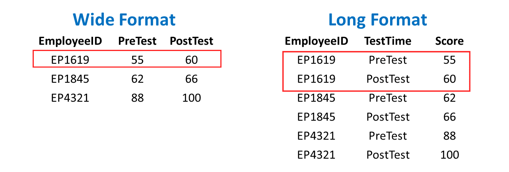

```{r setup, include=FALSE}
knitr::opts_chunk$set(echo = TRUE, warning = FALSE, message = FALSE, fig.height = 3, 
                      fig.align = 'center')
```

This lab focuses on manipulating, cleaning, and preparing data for visualization (or other analyses) using packages from the [tidyverse suite](https://www.tidyverse.org/packages/).

**Directions** (Please read before starting)

1) Please *work together* with your assigned partner. Make sure you both fully understand each concept before you move on.
2) Please record your answers and any related code for all embedded lab questions. I encourage you to try out the embedded examples, but you shouldn't turn them in.
3) Please ask for help, clarification, or even just a check-in if anything seems unclear.

$~$

## Preamble

### Motivation

Show below are the acceptance rates of three different liberal arts colleges from 2018 to 2020:

```{r, echo = FALSE, out.width="100%"}
library(ggplot2)
adm <-  c(28.9, 24.4, 23.1, 21.2, 19.8, 19.1, 33.7, 36.2, 36.4)
year <-  rep(c(2018, 2019, 2020), 3)
coll <-  c(rep("Grinnell",3), rep("Carlton", 3), rep("Oberlin", 3))
df <-  data.frame(adm, year, coll)
ggplot(df, aes(x = year, y = adm, col = coll)) + geom_line() + geom_point() + theme_minimal() + 
  labs(x = "Year", y = "Percent Accepted", col = "College") + scale_x_continuous(breaks = 2018:2020, labels = c(2018,2019,2020))
names(df) = c("Adm_Rate", "Year", "College")
```

As a data scientist, you must be able to connect the *format* of a data set with the information presented in a graph.

1) If creating an excel spreadsheet, how do you think most people would record these data?
2) What format of these data is most accessible to the `ggplot()` function?

$~$

### Long vs. Wide Data

Data in a **wide format** record *many different values* or variables for a *single entity in a single row* (ie: acceptance rates for a college in different years, or different test scores for the same employee).

Data in a **long format** use *multiple rows* and a *single column* for the outcome or value of interest (ie: acceptance rate, test score, etc.) with additional columns identifying the meaning of that value.

Example:




```{r, echo = FALSE, eval = FALSE}
## Create Stocks data
quantmod::getSymbols(c('AAPL','BRK', 'KO','JNJ', 'AXP'), from = as.Date("2010-01-01"), to = as.Date("2022-01-05"))
rids <-  c(1,253,505,755, 1007, 1259, 1511, 1763, 2014, 2266, 2518, 2770, 3022)
df <- data.frame(year = 2010:2022, AAPL = AAPL$AAPL.Close[rids], KO = KO$KO.Close[rids], JNJ = JNJ$JNJ.Close[rids], AXP = AXP$AXP.Close[rids])
names(df) <- c("Year", "AAPL", "KO", "JNJ", "AXP")
#write.csv(df, "C:\\Users\\Ryan M\\Documents\\Grinnell\\remiller1450.github.io\\data\\bluechips.csv", row.names = FALSE)
bluechips <- df
```

The `ggplot2` package, as well as the implementations of many statistical models, expect data in **long format**.

$~$

### Tidy Data

Converting between "wide" and "long" formats is often the most challenging step in creating a "tidy" data set, or one that is fully prepared for graphing/modeling.  

In general, **tidy data** are defined by the following criteria:

1. Every column is a variable
2. Every row is an observation
3. Every cell is a single value

This lab will introduce several data manipulation functions used to help obtain tidy data.

$~$

### Packages and Datasets

This lab primarily uses `tidyr` package, which is used to "tidy" or reshape data into a more usable format. It will also use the `ggplot2` package.

```{r message = FALSE, warning = FALSE}
# Please install and load the following packages
# install.packages("tidyr")
library(tidyr)
library(ggplot2)
```

The lab will use several data sets:

```{r}
collegeAdm <- read.csv("https://remiller1450.github.io/data/college_adm.csv")
```

- **Description**: Admissions rates of three Midwestern liberal arts colleges according to [acceptancerate.com](https://www.acceptancerate.com/schools/grinnell-college)

```{r}
bluechips <- read.csv("https://remiller1450.github.io/data/bluechips.csv")
```

- **Description**: Closing prices on the first trading day of the year from 2010 to 2021 for four stocks that [The Motley Fool](https://www.fool.com/investing/stock-market/types-of-stocks/blue-chip-stocks/) calls "blue chip" investments.

```{r}
polls <- read.csv("https://remiller1450.github.io/data/polls2016.csv")
```

- **Description**: Polling data leading up to the 2016 US Presidential Elections scraped from [RealClearPolitics.com](https://www.realclearpolitics.com/epolls/2016/president/us/general_election_trump_vs_clinton_vs_johnson_vs_stein-5952.html#polls)

$~$

## Lab

At this point you will begin working with your partner. Please read through the text/examples and make sure you both understand before attempting to answer the embedded questions.

$~$

### Pivoting between long and wide formats

Consider the `collegeAdm` data frame:

```{r}
## Look at all 9 observations
head(collegeAdm, n = 9)
```

This data is currently in "long" format, meaning that each row is associated with a single observation (year, college, rate). We can convert our college admit data to a "wide" format using the `pivot_wider()` function:

```{r}
## Pivot from long to wide to get 1 row per Year
wideCollegeAdm <- pivot_wider(collegeAdm, 
                              id_cols = Year,
                              names_from = College, 
                              values_from = Adm_Rate)
head(wideCollegeAdm)
```

The following arguments guide the transformation:

- `id_cols` defines the rows of the "wide" data (i.e., each row will be a unique value of "Year")
- `names_from` defines the single column from the "long" data that should be spread into multiple distinct columns in the "wide" data (i.e., each "College" should get a column)
- `values_from` defines the single column from the "long" data containing the values used to populate the cells of the "wide" data (i.e., the columns created for each "College" should contain values of "Adm_Rate")

Notice what happens when `id_cols` and `names_from` are swapped:

```{r}
## Pivot from long to wide to get 1 row per College
wideCollegeAdm2 <- pivot_wider(collegeAdm, 
                              id_cols = College,
                              names_from = Year, 
                              values_from = Adm_Rate)
head(wideCollegeAdm2)
```

Similarly, the `pivot_long()` function will transform "wide" data into "long" data:


```{r}
pivot_longer(wideCollegeAdm2, 
             cols = c("2018", "2019", "2020"), 
             names_to = "Year", 
             values_to = "Adm_Rate")
```

- `cols` defines the column(s) used in the pivot, here this is each of the years variables that will be combined into a single variable
- `names_to` is the name of the single column in the "long" data frame that will store the *column names* of the "wide" data frame
- `values_to` is the name of the single column in the "long" data frame that will store the *values* from the cells of the "wide" data frame

It is worth noting that there a few alternative ways to specify the argument `cols`. The first is a syntax that is unique to the "tidyverse" and takes the form `!variable` to specify that we want to include all column names *except* `variable`. In the case of our admit date, it would look like `!College` to indicate that we want all column names *except* college

```{r}
## Note: for more than one column, you can use !C(col1, col2, ...)
pivot_longer(wideCollegeAdm2, 
             cols = !College, 
             names_to = "Year", 
             values_to = "Adm_Rate")
```

Alternatively, you can use the `names()` function, which returns all of the column names of a data frame, along with the `setdiff()` function, which returns the difference between two sets. So, for example, if we wanted all of the column names *except* for college, we could express this as follows:

```{r}
names(wideCollegeAdm2)
setdiff(names(wideCollegeAdm2), "College")

pivot_longer(wideCollegeAdm2, 
             cols = setdiff(names(wideCollegeAdm2), "College"), 
             names_to = "Year", 
             values_to = "Adm_Rate")
```

Ultimately, you are welcome to use whichever you find most comfortable or easiest to remember. 


**Question 1**: Convert the `bluechips` data to a long format where each stock's closing price on the first trading day of each year is recorded in a single column named "Price".

**Question 2**: Starting with the long format data frame you created in Question #1, recreate the original `bluechips` data set using `pivot_wider()`.

$~$

### Other `tidyr` functions

Reshaping is often only one step in the process of tidying a data set. Sometimes, data will contain multiple variables in a single column.  For example, consider the `polls` data set:

```{r}
head(polls)
```

The column `Date` contains two distinct variables, the start and end of the poll's sampling period. Similarly, `Sample` also contains two variables, the number of participants in the poll and the population that was sampled (registered voters or likely voters).

The `separate()` function is used to break a *character* column into multiple new columns:

```{r}
## Example #1
tidy_polls <- separate(polls, 
                       col = Date, 
                       into = c("Begin", "End"),
                       sep = " - ")
head(tidy_polls)
```

- `col` is the column to be separated
- `into` indicates the names of the new columns that should result from the separation
- `sep` is the character string used to identify splitting points (in this example it's `-` surrounded by a space on each side)

```{r}
## Example #2
tidy_polls <- separate(polls, 
                       col = Sample, 
                       into = c("Size", "Population"))
head(tidy_polls)
```

In Example #2, the "sep" argument is not explicitly provided. In this situation, `separate()` will attempt to guess an appropriate separator. While this is not generally recommended, it works well for simple character strings. More complex strings might require the use of *regular expressions*, a topic we'll cover later this semester.

**Question 3 (Part A)**: Using either the `pivot_longer()` or `pivot_wider()` function, create a version of the `tidy_polls` data containing the variables `Candidate` and `Percentage`, where `Candidate` is taken from the names of the last four columns of the data frame, and "Percentage" is taken from the values contained in these columns. It should look like this:

```{r, echo = FALSE}
tt <- pivot_longer(tidy_polls, cols = c("Clinton..D.", "Trump..R.", "Johnson..L.", "Stein..G."), names_to = "Candidate", values_to = "Percentage")
head(tt, n = 4)
```


**Question 3 (Part B)**: Using the `separate()` function, split the column "Candidate" (created in Part A) into two distinct columns containing the name of the candidate (ie: Clinton, Trump, etc.) and their political party (ie: D, R, etc.). *Hint*: periods, or `.`, are a special character in `R`, but you can reference one using the expression: `\\.`. The `\\` is known as an "escape sequence" telling `R` to ignore the special character status of whatever follows. If you have multiple special characters in a row, you will need to be sure to "escape" each one of them

$~$

### Practice 

The "airlines" data set (loaded below) contains data used in the article [Should Travelers Avoid Flying Airlines That Have Had Crashes in the Past?](http://fivethirtyeight.com/features/should-travelers-avoid-flying-airlines-that-have-had-crashes-in-the-past/) that appeared on fivethirtyeight.com.

```{r}
airlines <- read.csv("https://raw.githubusercontent.com/ds4stats/r-tutorials/master/tidying-data/data/airline-safety.csv")
head(airlines)
```

Recall that a "tidy" version of these data should satisfy the following:

- Each row is a single airline in a specific time period (ie: Air Canada in 1985-1999 or Alaska Airlines in 2000-2014)
- Each column contains only a single variable
- Each cell contains only a single value

**Question 4 (Part A)**: Use `pivot_longer()` to gather the last six columns of the `airlines` data into a column named `accidents` and a column named `count`.

```{r, echo = FALSE, eval = FALSE}
tt <- pivot_longer(airlines, 
             cols = setdiff(colnames(airlines), c("airline", "avail_seat_km_per_week")), 
             names_to = "accidents", values_to = "count")
head(tt, n = 5)
```


**Question 4 (Part B)**: Use `separate()` to split the `accidents` column into two variables named `type` and `years`. *Hint*: remember that the period is a special character in `R`.

```{r, echo = FALSE, eval = FALSE}
tt2 <- separate(tt, 
               col = "accidents", 
               into = c("type", "years"), 
               sep = "\\.")
head(tt2, n = 5)
```


**Question 4 (Part C)**: Use `pivot_wider()` to spread out the `type` column into three new columns containing the type of accident (use the `table()` function to see the types of accidents). Your data should now contain two rows per airline (one for each time period), you can check if the first few rows match those printed below.

```{r, echo = FALSE, eval = FALSE}
tt3 <- pivot_wider(tt2, 
                   id_cols = setdiff(names(tt2), c("type", "count")), 
                   names_from = type, values_from = count)
head(tt3, n = 5)
```


```{r, echo = FALSE, eval = FALSE}
## Part A
tidy_airlines <- pivot_longer(airlines, cols = !c(airline, avail_seat_km_per_week), names_to = "accidents", values_to = "count")

## Part B
tidy_airlines <- separate(tidy_airlines, col = "accidents", into = c("var", "years"), sep = "[.]")

## Part C
tidy_airlines <- pivot_wider(tidy_airlines, id_cols = c(airline, avail_seat_km_per_week, years), names_from = var, values_from = count)

head(tidy_airlines)
```

**Question 4 (Part D)**: Using `ggplot2`, create a scatter plot displaying the relationship between `avail_seat_km_per_week`, `fatal_accidents`, and `years`

```{r, eval = FALSE, echo = FALSE}
ggplot(tidy_airlines, aes(x = avail_seat_km_per_week, y = fatal_accidents, col = years)) + geom_point()
```

$~$
---

**Question 5** The `iris` dataset builtin to `R` is a collection of measurements (in cm) of the sepal and petal dimensions of 50 different flowers coming from three different species of iris (I have verified that all of the values in this dataset are what they should be -- no surprise numerics or factors!)

```{r, fig.align='center', fig.width = 4, fig.height = 4, echo = FALSE}

```


Your goal is to recreate the following graphic using the `tidyr` functions covered in this lab

```{r}
## Load data
data(iris)
```


```{r, fig.width = 8, fig.height = 5, echo = FALSE}
tt1 <- pivot_longer(iris, cols = !Species, 
                    names_to = "Part", values_to = "Values")
tt2 <- separate(tt1, col = "Part", into = c("Part", "Measurement"), sep = "\\.")

library(ggplot2)
ggplot(tt2, aes(Species, Values, color = Part)) +
  geom_jitter(width = 0.15) +
  facet_wrap(~Measurement) + theme_bw() +
  theme(axis.text.x = element_text(angle = 45, vjust = 0.5))
```


